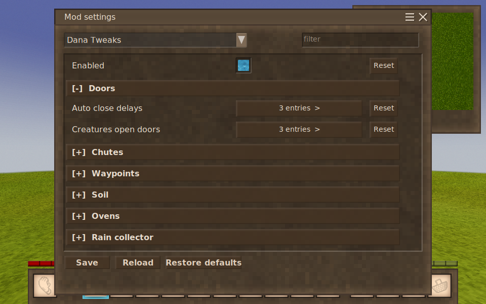
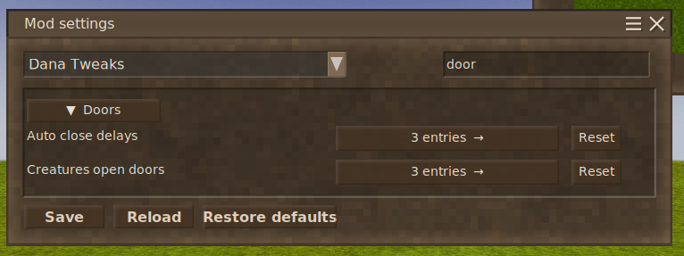
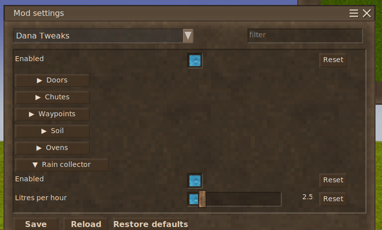
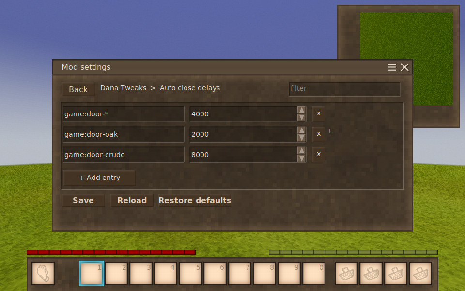
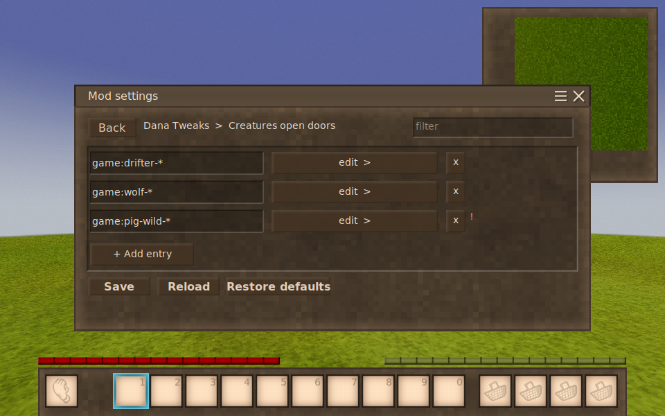
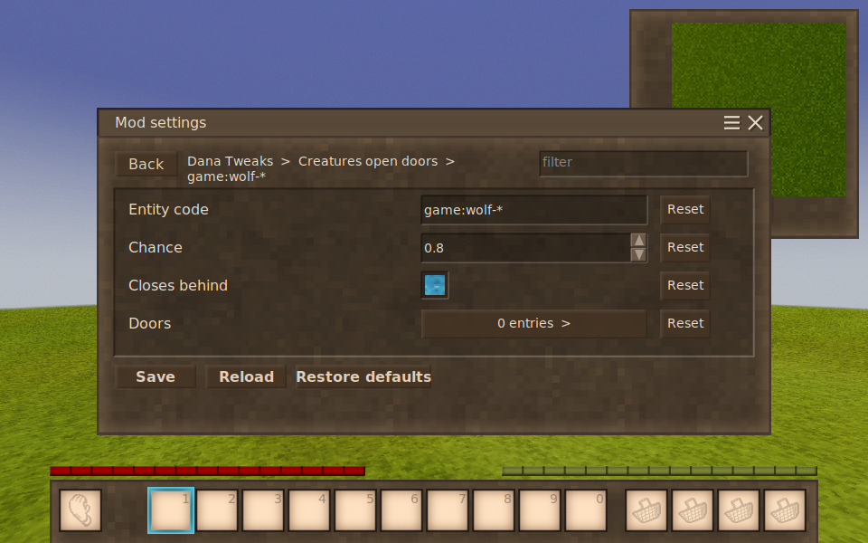
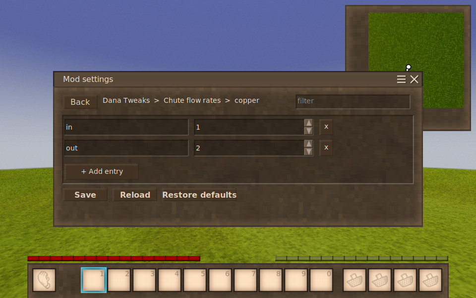

# Structured config

Sub-objects, dictionaries and lists in a settings class — and what a player sees.

This is the part that used to send mod authors to a hand-written Dear ImGui panel. It
doesn't any more: annotate a plain C# class and ConfigKit builds the screen, the file, the
server sync and the reset behaviour from it.

Your settings class keeps **no reference to ConfigKit**. Every attribute below is stock
.NET, so the class compiles and runs unchanged with ConfigKit not installed.

If your config is a flat list of numbers and switches, you don't need this page —
[MIGRATING.md](MIGRATING.md) covers that in four lines.

---

## The short version

```csharp
public class TweaksConfig
{
    public bool Enabled = true;                              // a row

    public RainCollector RainCollector = new();              // a section

    [Category("Doors")]
    [DataType("blockcode")]
    public Dictionary<string, int> AutoCloseDelays = new();   // opens its own screen

    public Dictionary<string, DoorRule> CreaturesOpenDoors = new();
    public List<string> Blacklist { get; } = new();           // get-only is fine
}
```

```csharp
api.ModLoader.GetModSystem<ConfigKitModSystem>()
   .RegisterManagedConfig("danatweaks", config, "DanaTweaks.json");
```

That's the whole integration. No draw delegate, no `ControlButtons`, no widget ids.

---

## What each shape becomes

### A plain field is a row

Fields that belong to no section sit at the top of the screen and are always visible.

### A nested class is a section

No attribute needed — the class is the group, and each of its fields becomes an ordinary
row with its own slider, switch, dropdown and **Reset**.

```csharp
public class RainCollector
{
    [Description("Collect rain at all.")]
    public bool Enabled = true;

    [Description("Litres gathered per hour of rain.")]
    [Range(0.1, 20.0)]
    public float LitresPerHour = 2.5f;
}
```



**Sections fold, one at a time.** A mod with a dozen sub-configs is a dozen headings and one
body, rather than a screen to scroll through. If the whole config fits without scrolling
nothing is folded at all — there's no point hiding four settings behind three headings.

**There is a filter box beside the mod dropdown**, and it cuts across the folding — a
search for "door" shows every match, not the matches that happen to be in whichever section
is open. A section's own name matches too, which brings out its whole body.



Sections nest. A class inside a class gets a heading carrying both names, so a field three
classes down still says where it came from:



In the file it stays nested, exactly as `StoreModConfig` would have written it:

```json
{
  "Enabled": true,
  "RainCollector": { "Enabled": true, "LitresPerHour": 2.5 }
}
```

### A dictionary or list opens its own screen

One row on the main screen showing how many entries it holds; clicking it opens the
container, with a breadcrumb back out, a filter, per-row delete, and Add.



Why a separate screen rather than expanding in place: these are unbounded. A dictionary
keyed by block code routinely runs to hundreds of entries in a real pack, and an entry row
needs a different set of columns — key, value, delete — than a settings row does.

### A dictionary of classes drills down again

The value's own fields, each with the right control:





The row label comes from the field marked `[Key]`, falling back to the first string field,
then an overridden `ToString()`, then `#0`. So you usually annotate nothing.

### Nesting costs nothing

`Dictionary<string, Dictionary<string, float>>` is the shape nothing else handles
generically. Here the second level is the first level again:



---

## Attributes

All stock .NET. `System.ComponentModel`, `System.ComponentModel.DataAnnotations`, and
`Newtonsoft.Json` — which your mod already references if it uses `LoadModConfig<T>`.

| Attribute | Effect |
|---|---|
| `[Description("…")]` | Hover text on the label |
| `[Range(min, max)]` | Slider instead of a text box |
| `[DefaultValue(x)]` | The value Reset goes back to |
| `[AllowedValues(…)]` | Dropdown of fixed choices |
| `[Category("Doors")]` | Puts the setting in a section called Doors |
| `[Category("Doors, clientside")]` | Section, plus the flag |
| `[DisplayName("…")]` | Label, instead of the tidied-up field name |
| `[Display(GroupName=, Name=, Order=)]` | Section, label and sort weight |
| `[Key]` | On a field of a list element: which field labels its row |
| `[DataType("blockcode")]` | Keys are block codes — see below |
| `[JsonProperty("…")]` | The key to write in the file |
| `[Browsable(false)]` | Hidden from the screen, **still saved** |
| `[JsonIgnore]` | **Not saved** and not shown |
| `[ReadOnly(true)]` | Shown, not editable |

`[Browsable(false)]` and `[JsonIgnore]` are deliberately different. The first is about
display and keeps the key in the file; the second is about serialisation and removes it.
Reach for `Browsable` unless you actually want the value gone.

Labels come from the field name, tidied up: `LitresPerHour` reads "Litres per hour". Ship a
translation for `<yourmod>:setting-LitresPerHour` to override it for real, or `[DisplayName]`
for a quick fix.

### `[DataType]`, and why it earns its place

A dictionary keyed by block code is the commonest structured setting there is, and a typo
in one of those keys **does nothing at all** — the entry sits in the file looking perfectly
correct and simply never matches. Nothing in the game tells you.

```csharp
[DataType("blockcode")]                 // or "itemcode", or "entitycode"
public Dictionary<string, int> AutoCloseDelays = new();
```

The screen then marks any key that names nothing loaded, and puts an example in the empty
field. In the screenshot above, `game:door-*` and `game:door-crude` are fine;
`game:door-oak` is flagged, because it looks exactly like a real code and isn't one.

**Wildcards count as valid.** `game:door-*` matches a great many blocks and is exactly as
correct as naming one.

It only ever marks a definite no. A field with no `[DataType]`, an unrecognised one, or a
registry that hasn't finished loading gets no opinion — flagging every key on an
unannotated dictionary would be far worse than saying nothing.

---

## What you get for free

**Keys can't collide.** Renaming an entry onto a name already in use is refused with a
message; the entry that was there is not replaced. Add invents a key that is free rather
than landing on one in use — and where there is no free key to invent, such as a dictionary
keyed by a three-member enum that already holds three entries, the button is replaced by a
line saying why.

**Keys commit when you leave the field**, or press Enter — never per keystroke. Typing
`abc` passes through `a` and `ab`, either of which might collide with something.

**Save, Reload and Restore defaults act on the whole config**, from however deep you are.
Restore asks once, because three levels down it looks local.

**Every public field is accounted for.** Anything ConfigKit can't render is reported at
registration rather than dropped in silence — look for this in the log:

```
[ConfigKit] Registered 'danatweaks': 6 settings, 5 sections, 4 containers.
```

followed by a line for anything it couldn't make editable, with the type and the reason.

---

## Types that work

**Scalars** — `bool`, `string`, `int`, `long`, `short`, `byte`, `float`, `double`,
`decimal`, and enums. An enum becomes a dropdown of its member names, and is **stored by
name**, so renaming a member fails loudly instead of silently landing on whatever now holds
its old number.

**Containers** — `Dictionary<,>`, `List<>`, `HashSet<>`, arrays, and anything implementing
`IDictionary<,>`, `IList<>`, `ICollection<>` or `IReadOnlyCollection<>`.

**Dictionary keys** — `string`, enums, and any type with a `TypeConverter`, which includes
`AssetLocation`.

**Nesting** — classes inside classes, dictionaries of dictionaries, lists of classes
holding lists. Capped at five levels deep, and a class that holds itself is detected and
skipped rather than recursed into.

**`Dictionary<string, JToken>`** round-trips untouched, so the usual "read the old config
and migrate it" field keeps working.

**Get-only collections** — `public List<string> X { get; } = new();` is filled in place
rather than replaced, so a reference your mod took to that list stays live.

Anything else Newtonsoft can round-trip is shown as raw JSON, which is honest and editable.
Anything it can't is reported and left alone.

---

## Server and client

A setting is server-owned unless it says otherwise. On a server that runs ConfigKit, a
client without `controlserver` sees those read-only; the privilege is checked and audited on
the server before any change is applied, so the read-only rendering is a courtesy, not the
enforcement.

Mark the ones that are genuinely per-player:

```csharp
[Category("Waypoints, clientside")]
public List<string> ExtraWaypointColors = new();
```

Because sub-objects flatten, this works **per field** — you can have one class where some
fields are server truth and others are client preference, which a per-object split cannot
express.

---

## Migrating an existing config

If your mod already uses `api.LoadModConfig<T>()`, the shape on disk is the same, so your
players' existing files keep loading. Two things to check:

1. **`[JsonProperty]` names are honoured**, and the field name is kept as a fallback the
   reader still accepts. A rename never orphans a stored value.
2. **Fields that were previously invisible now appear** in the file and on screen. That is
   the point of the change; `[Browsable(false)]` is the opt-out if you want one hidden.

What you delete: the `RegisterCustomConfig` delegate, the four-flag `ControlButtons`
handling, the `##label-{i}-{id}` suffixes, and your copy of `DictionaryEditor<T>`.

---

## Regenerating these screenshots

They come from a fixture rather than a drawing, so they can't drift from the real screen:

```bash
cd ~/src/anego-1.22/vstestkit
bash scripts/sync-linux.sh dizzyd@vsclient.home --mod ../configkit/configkit
ssh dizzyd@vsclient.home 'cd vstestkit-configkit && \
  bash scripts/run.sh ~/mods/configkit/tests --mod ~/mods/configkit/configkit \
       --client --filter TakeDocumentationShots'
```

The fixture is `tests/ShotsTest.cs`; the crop is 766px wide from the centre of a 960x600
frame.
